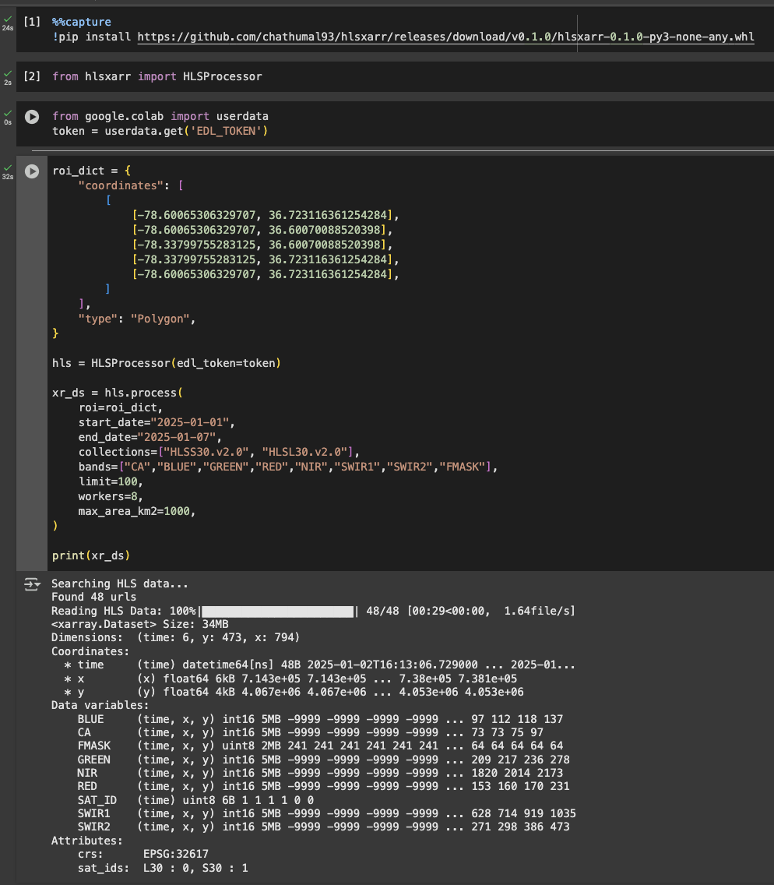

# hlsxarr

`hlsxarr` is a Python package that allows users to read Harmonized Landsat and Sentinel data as an `xarray.Dataset` directly from a STAC API (as a data cube). Users can define a region of interest (ROI) in GeoJSON format and retrieve the data in the projected CRS of that ROI.

The data is loaded directly into memory, so ensure that you have sufficient memory available when choosing the size of your ROI. Data is fetched using Python parallel processing, and it's recommended to adjust the number of workers according to the available CPU cores.

### Supported Bands
The package supports the following common bands of both satellites:
- `CA`,`BLUE`,`GREEN`,`RED`,`NIR`,`SWIR1`,`SWIR2`,`FMASK`

### Requirements
 - Save Earth Data Login (EDL) Token from Earthdata Login profile https://urs.earthdata.nasa.gov/documentation as an environment variable called `EDL_TOKEN`.
 - Python Version = ">=3.11"

### Installation
``` bash
pip install https://github.com/chathumal93/hlsxarr/releases/download/v0.1.0/hlsxarr-0.1.0-py3-none-any.whl
```

### Example Usage
``` python
from hlsxarr import HLSProcessor

roi_dict = {
     "coordinates": [
         [
             [-78.60065306329707, 36.723116361254284],
             [-78.60065306329707, 36.60070088520398],
             [-78.33799755283125, 36.60070088520398],
             [-78.33799755283125, 36.723116361254284],
             [-78.60065306329707, 36.723116361254284],
         ]
     ],
    "type": "Polygon",
 }

# EDL_TOKEN from env var
hls = HLSProcessor()

xr_ds = hls.process(
    roi=roi_dict,
    start_date="2025-01-01",
    end_date="2025-01-07",
    collections=["HLSS30.v2.0", "HLSL30.v2.0"],
    bands=["CA", "BLUE", "GREEN", "RED", "NIR", "SWIR1", "SWIR2", "FMASK"],
    limit=100,
    workers=8,
    max_area_km2=1000,
)

# Selecting data based on Satellite id
# HLSL30_ds = xr_ds.sel(time=xr_ds.SAT_ID == 0, drop=True)
# HLSS30_ds = xr_ds.sel(time=xr_ds.SAT_ID == 1, drop=True)
```
### Run on Google Colab

